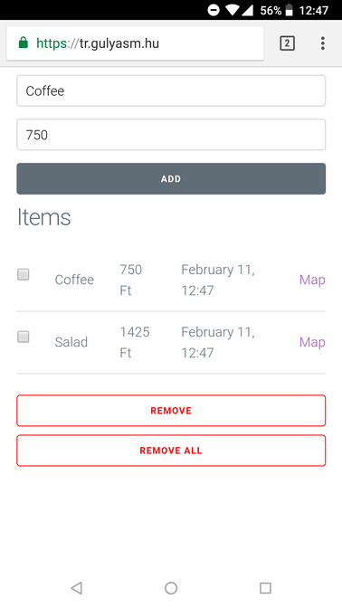

# Cest
Cest is a time and geotagged expense tracker web application. Okay, this might need some explanation. I track my expenses in GNUCash that runs on my laptop. I need an application on my phone that I can use to track the cash expenses I make throughout the day. Sometimes I input these expenses to GNUCash after 2 weeks. My memory is not that good, I forget where I spent cash. With time and geolocation, it's way easier to figure it out. 2:00 AM at a bar. Probably beer. 6:46 AM, coffee shop. Yes, that's that 3 EUR latte.

## Enough with the explanation, show me a screenshot!
Here you go:

## Data stored ONLY locally
The website is available on [tr.gulyasm.hu](https://tr.gulyasm.hu). No login? Financial data without authentication? Yes! It stores all your data in local storage. No need for authentication. Feel free to use it.

## Pure JS, not framework
I was curious how to write maintainable code in JS without some fancy framework like _xxxxxxxxxx_ (insert your most hated but hyped JS framework. I'll go with Angular). 
Apart from the actual use case I have with my expense tracking, this project also serves an example that sometimes pure JS is just enough.

## FAQ
### It's ugly on Desktop.
It was intended to use on mobile. This is the next step in evolution. Not mobile-first, mobile-only. My mobile only, I didn't test it on other devices.

### There is a better way to do _+++++++++_!
Please, send me a PR! I'm eager to learn. Maybe it's time to confess, but I'm not a frontend developer. I'm a data engineer, but I'm more than happy to learn!
